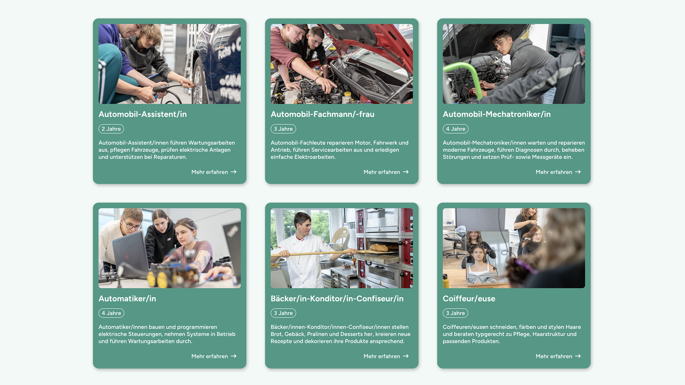
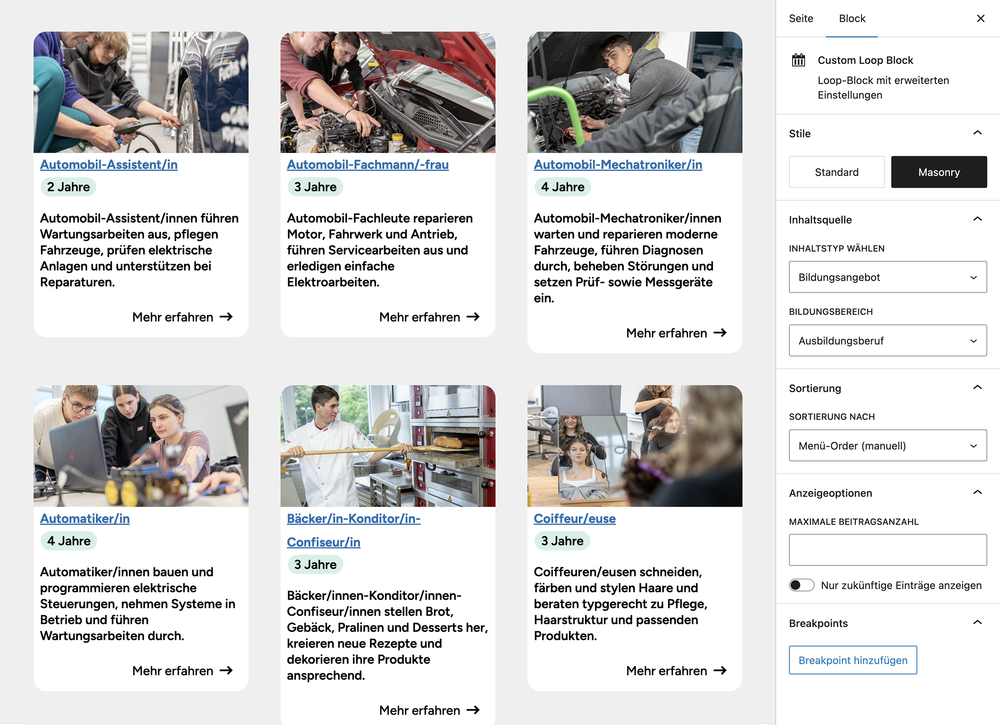

# UD Loop Block

Der UD Loop Block ist ein modularer, REST-gesteuerter Inhaltsblock, der Inhalte aus verschiedenen CPTs dynamisch rendert.
Er erkennt automatisch, wenn ein Bildungsangebot oder eine Seite mit Datumsblöcken gewählt wird, und aktiviert entsprechende Filteroptionen oder REST-Abfragen.
Damit ist er universell einsetzbar für News-, Bildungs- und datumsbasierte Inhaltsübersichten innerhalb von Full Site Editing Themes.

## Screenshots

*Loop-Block in der Frontend-Ansicht*

*Loop-Block in der Editor-Ansicht.*

## 1. Funktionen

Der UD Loop Block bietet verschiedene globale Einstellungen:

### Sortierung
- **sortMode** legt fest, nach welchem Kriterium die Beiträge sortiert werden:
  - `published` – nach Veröffentlichungsdatum (Standard)
  - `menu-order` – nach manueller Reihenfolge
  - `datetime-block` – nach Datumselementen innerhalb eines `ud/datetime-block`
- Wenn `postType === "datetime-page"` gewählt wird, wird `sortMode` automatisch auf `"datetime-block"` gesetzt.
- Wenn keine Datumsblöcke gefunden werden, wird `sortMode` automatisch auf `"published"` zurückgesetzt.
- **sortOrder** bestimmt die Reihenfolge (`ASC` oder `DESC`).

### Anzeigeoptionen
- **postCount** – Anzahl der angezeigten Beiträge, gemerkt pro Post-Type.
- **selectedPageParent** – nur aktiv, wenn `postType === "page"`; zeigt Unterseiten einer gewählten Elternseite.
- **selectedPageId** – aktiv, wenn `postType === "datetime-page"`; Auswahl einer Seite mit Datumsblöcken.
- **filterFutureDates** – boolescher Filter, gemerkt pro Post-Type; wird nur für `page` und `ud_news` verwendet.

### Responsive Breakpoints
- Steuern die Anzahl angezeigter Beiträge bei unterschiedlichen Bildschirmbreiten.
- Jeder Breakpoint enthält:
  - `maxWidth` – obere Grenze des Viewports in Pixeln
  - `items` – Anzahl der anzuzeigenden Elemente
- Breakpoints können im Editor hinzugefügt, geändert oder entfernt werden.
- Änderungen werden automatisch mit dem Attribut `breakpoints` synchronisiert.

## 2. Post-Types

Der Block verarbeitet folgende Post-Types:

* **post** – Standardbeiträge
* **page** – Standardseiten
* **ud_news** – Nachrichten / Aktuelles
* **ud_bildungsangebote** – zentraler CPT für Bildungsinhalte

### Besonderheiten

* Wenn `postType === 'ud_bildungsangebote'`, werden zusätzliche Editor-Optionen geladen:

  * Taxonomie **bildungsbereich** (REST-Endpunkt: `/wp/v2/bildungsbereich`)
  * Dynamische SelectControl zur Filterung nach Bildungsbereichen

* Wenn `postType === 'datetime-page'` (Einzelseite mit Datum-Blocks) gewählt wird,
  durchsucht der Block reguläre Seiten nach dem Vorkommen des Blocks **`ud/datetime-block`**.
  Nur Seiten, die diesen Block enthalten, werden über den REST-Endpunkt
  `/wp-json/ud-loop-block/v1/datetime-pages` bereitgestellt und können im Editor ausgewählt werden.
  Dadurch lassen sich gezielt Seiten mit zeitlich strukturierten Inhalten (Datumsabschnitten) im Loop darstellen.

* Wenn `postType` andere CPTs betrifft (z. B. `ud_news`), entfallen diese Zusatzoptionen.

## 3. Konditionale Logik im Editor (edit.js)

* **`postType`-abhängige UI:**

  * `postType === 'ud_bildungsangebote'` → zeigt zusätzlich ein dynamisches Select-Feld für `bildungsbereich`
  * `postType === 'datetime-page'` → aktiviert spezielle REST-Abfrage und Auswahl von Seiten mit `ud/datetime-block`
  * Andere Post-Types → zeigen statische Filterfelder (z. B. Anzahl, Sortierung, Reihenfolge)

* **REST-basierte dynamische Optionen:**

  * Begriffe der Taxonomie `bildungsbereich` werden über `wp.data` / `apiFetch` geladen.
  * Diese werden im Editor als Optionen dargestellt, sobald `postType` gewechselt wird.

* **Attributabhängigkeiten:**

  * Wenn `contentType` gesetzt ist, kann `postType` überschrieben werden (z. B. Gruppierung mehrerer Bildungsangebote unter einem logischen Typ).
  * Änderung von `postType` → Resets relevanter Taxonomieattribute (`terms`, `bildungsbereich`).

### Übersicht der Editor-Logik

| Bedingung                            | Aktion / Auswirkung                                                        |
|--------------------------------------|----------------------------------------------------------------------------|
| `postType === 'ud_bildungsangebote'` | Zeigt Select-Feld „Bildungsbereich“, ruft REST `/wp/v2/bildungsbereich` ab |
| `postType === 'datetime-page'`       | Durchsucht Seiten nach `ud/datetime-block` und zeigt nur gefundene an      |
| `postType === 'ud_news'`             | Standardanzeige, keine zusätzlichen Taxonomien                             |
| `contentType` gesetzt                | Überschreibt Post-Type-Zuweisung (z. B. Gruppierung)                       |
| REST-Response leer                   | Zeigt Platzhalterhinweis im Editor                                         |

## Autor

[ulrich.digital gmbh](https://ulrich.digital)

## Lizenz

GPL v2 or later
[https://www.gnu.org/licenses/gpl-2.0.html](https://www.gnu.org/licenses/gpl-2.0.html)

