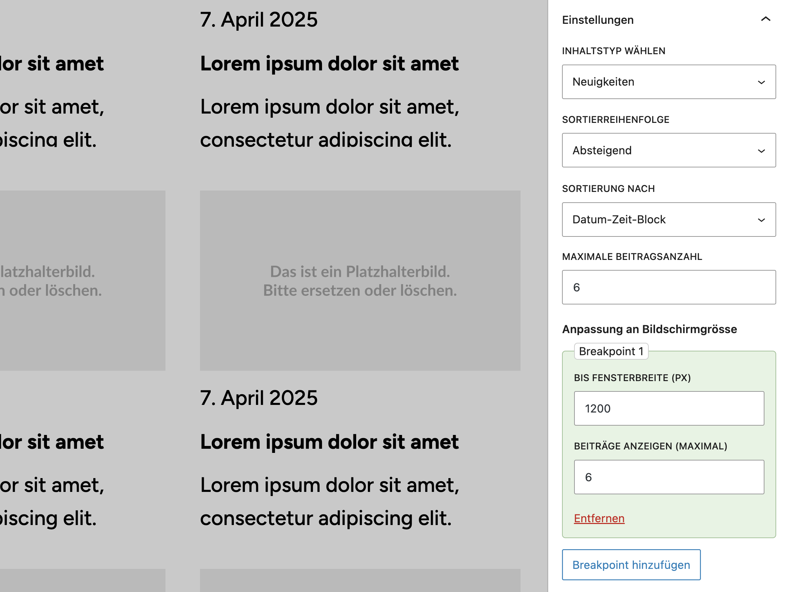

# Loop Block Plugin

Ein Gutenberg-Block zur flexiblen Ausgabe von Inhalten in WordPress – mit konfigurierbarer Sortierung, Layout-Optionen, responsivem Verhalten und Live-Vorschau im Editor. Entwickelt für Projekte, in denen Inhalt, Kontext und Darstellung präzise steuerbar sein müssen.

## Funktionen

  
*Abbildung: Loop-Block – Einstellungen in der rechten Seitenleiste: Inhaltstyp, Sortierung und Breakpoints mit Live-Vorschau.*

### Inhaltstyp wählen
Der Block unterstützt Beiträge, Seiten und benutzerdefinierte Inhaltstypen (Custom Post Types). 
Bei Auswahl von „Seiten“ kann eine Elternseite gewählt werden – es werden die zugehörigen Unterseiten ausgegeben.

### Sortierung
Es stehen mehrere Sortieroptionen zur Verfügung – darunter:
- Veröffentlichungsdatum
- Menü-Order (manuell)
- Titel
- Benutzerdefinierte Felder

Falls der gewählte Inhaltstyp den **„Date-Time Block“ von ulrich.digital** verwendet, wird dieser automatisch als zusätzliche Sortieroption angeboten. 

### Layout-Optionen
Die Standarddarstellung erfolgt im `.ud-loop-default`-Layout. Zusätzlich kann ein **„Masonry“-Stil** aktiviert werden. Dabei werden Beiträge in einem dynamischen, rasterähnlichen Layout angeordnet, gesteuert über **Isotope.js**. Dieses Verhalten eignet sich besonders für inhaltsreiche Darstellungen mit ungleich hohen Kacheln.

Bei Seitenausgaben (hierarchisch) kann zusätzlich gewählt werden, ob:
- ein vorhandener Teaser-Block verwendet wird (sofern enthalten), oder
- Titel und Beitragsbild ausgegeben werden.

### Responsive Breakpoints
Das Plugin erlaubt eine **fein abgestufte Steuerung pro Bildschirmgrösse**. Im Block-Inspector können beliebig viele Breakpoints definiert werden. Jeder Breakpoint besteht aus:
- einer maximalen Fensterbreite in Pixeln (`max-width`)
- der maximalen Anzahl anzuzeigender Beiträge bei dieser Breite

Beispiel:  
Ein Breakpoint bei 1200 px mit `9` Beiträgen sorgt dafür, dass auf Viewports bis 1200 px nur neun Elemente geladen und dargestellt werden.

Die Breakpoint-Daten werden sowohl im Editor (Live-Vorschau) als auch im Frontend berücksichtigt.

### Dynamisches Rendering im Editor
Sämtliche Konfigurationen werden direkt im Editor umgesetzt – inklusive Sortierung, Layout, Beitragstyp-Auswahl und Breakpoints. Änderungen sind sofort sichtbar.

### Kontextweitergabe bei verschachtelten Blöcken
Der Block kann andere Blöcke enthalten (z. B. Teaser-Blöcke) und gibt diesen automatisch den benötigten Kontext (z. B. aktuelle Post-ID) mit. Dadurch lassen sich innerhalb des Loop-Blocks auch dynamische Sub-Elemente korrekt rendern.

## Technischer Aufbau

